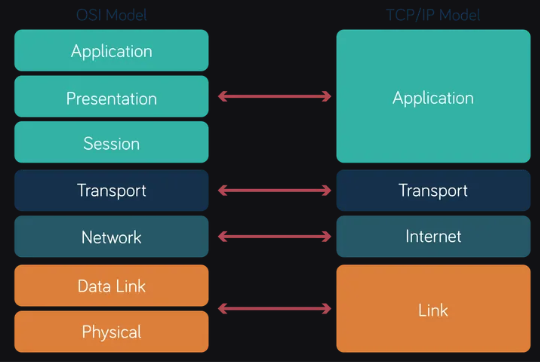

# 📡 Computer Networks - DAY 1 Learning Notes

## 🎯 Understanding Networking Basics

At its core, a **network** is simply a **collection of interconnected devices** like computers, servers, and other network equipment, all working together to **share resources and information**.

### 🧸 Real-Life Analogy: Friends Sharing Toys

Imagine a group of friends who want to share their toys and communicate with each other:
- **Same Room:** They can talk and pass toys directly → Simple network
- **Growing Group:** As the group expands and spreads out, they need organized ways to communicate and share → Advanced networking concepts

This is exactly how computer networks evolved!

---

## 1. 📚 Important Definitions (The Vocabulary of Networks)

Just like any field, computer networking has its own language. Understanding these key terms will make subsequent topics much clearer.

### 🔧 Core Networking Terms

#### **Protocol**
**Definition:** A **set of rules and conventions** that dictate how data is transmitted and received in a network.

**🗣️ Analogy:** When you speak to someone, you follow rules like:
- Taking turns
- Using a common language (e.g., English)  
- Understanding what "hello" means

Without these unspoken rules, communication would be chaotic. Similarly, computers use protocols to ensure they understand each other.

---

#### **IP Address**
**Definition:** A **numerical label assigned to each device** connected to a computer network using Internet Protocol (IP).

**Functions:**
- Identifying the host or network interface
- Providing location addressing

**🏠 Analogy:** Your unique home address. If someone wants to send you mail, they use your address.

---

#### **Router**
**Definition:** A networking device that **forwards data packets between different computer networks**. Operates at the **network layer** of the OSI model.

**🚦 Analogy:** A traffic controller at a major intersection:
- Looks at destination address on each "car" (data packet)
- Directs it onto correct "road" (network) to reach target
- Connects your home network to the internet

---

#### **Switch**
**Definition:** A networking device using **MAC addresses to forward data frames within a LAN**. Operates at the **data link layer**.

**Key Feature:** "Smarter" than hubs - learns which devices connect to which ports and sends data only to intended recipient.

**📮 Analogy:** Smart mail sorter in local post office:
- Knows exactly which house (MAC address) each letter (data frame) goes to
- Delivers directly rather than announcing to whole town

---

#### **Firewall**
**Definition:** Security device/software that **monitors and controls network traffic** based on predetermined security rules.

**🛡️ Analogy:** Security guard at building entrance:
- Checks credentials against set of rules
- Decides who can enter or leave
- Protects the interior

---

#### **Gateway**
**Definition:** Network node that **connects different networks**, translating protocols when necessary.

**🌐 Analogy:** Border control point with language translation:
- Allows people from different countries (networks)
- Speaking different languages (protocols) to communicate

---

#### **Subnet**
**Definition:** A **logical subdivision of an IP network** for better organization and security.

**🏙️ Analogy:** Large city (IP network) divided into smaller neighborhoods/districts:
- Each district belongs to city but is easier to manage individually

---

### 🌐 Network Scope Terms

#### **LAN (Local Area Network)**
**Definition:** Network limited to **small geographic area** (single building/campus) with high data transfer rates.

**🏠 Analogy:** Your home network or single office building network - communication is fast because everything is close.

---

#### **WAN (Wide Area Network)**
**Definition:** Network covering **broad area** (city, country, global). Connects multiple LANs using various technologies.

**🛣️ Analogy:** Highway system connecting different cities (LANs).

---

### 🔍 Network Services

#### **DNS (Domain Name System)**
**Definition:** Protocol translating **human-readable domain names** (like "google.com") **into numerical IP addresses**.

**📞 Analogy:** Internet's phone book:
- You remember "google.com" (name)
- Computer needs "142.250.190.142" (IP address)
- DNS does this lookup

---

#### **DHCP (Dynamic Host Configuration Protocol)**
**Definition:** Protocol **automatically assigning IP addresses and network configuration** to devices.

**🏨 Analogy:** Hotel front desk automatically assigning room numbers (IP addresses) to guests (devices) upon check-in.

---

### 📦 Data Transmission Terms

#### **Packet**
**Definition:** **Unit of data transmitted over network** with actual data and control information (source/destination addresses).

**📚 Analogy:** Sending a large book:
- Don't send whole book at once
- Break into individual pages
- Put each page in separate envelope (packet) with addresses

---

#### **Bandwidth**
**Definition:** **Maximum rate of data transmission** over network, measured in bits per second (bps).

**🚰 Analogy:** Width of water pipe - wider pipe (higher bandwidth) carries more water (data) at once.

---

#### **Latency**
**Definition:** **Time delay between network request initiation and response receipt**, measured in milliseconds (ms).

**⏱️ Analogy:** Time for water drop to travel from one pipe end to other - even wide pipe can have high latency if very long.

---

### 🔄 Protocol Types

#### **TCP (Transmission Control Protocol)**
**Definition:** **Connection-oriented protocol ensuring reliable and ordered data delivery** using sequence numbers, acknowledgments, and retransmissions.

**📬 Analogy:** Registered letter:
- Post office confirms receipt
- If lost, they resend it
- Slower due to checks, but very reliable

---

#### **UDP (User Datagram Protocol)**
**Definition:** **Connectionless protocol providing simple, faster data transmission**. No delivery/order guarantees - suitable for real-time applications prioritizing speed.

**📮 Analogy:** Sending postcard:
- Send without confirmation
- Fast, no setup required
- If lost, you won't know unless recipient tells you

---

#### **MAC Address**
**Definition:** **Unique identifier assigned to network interfaces** for data link layer communications. Hardware address.

**🏷️ Analogy:** Unique serial number etched onto network card at factory.

---

### 🔐 Additional Important Terms

**Other crucial definitions include:**
- **HTTPS:** Secure HTTP
- **FTP:** File Transfer Protocol
- **SSL/TLS:** Secure communication protocols
- **ARP:** Maps IP to MAC addresses
- **NAT:** Network Address Translation
- **QoS:** Quality of Service
- **Ping:** Network utility testing reachability
- **Traceroute:** Shows path to destination
- **Wireshark:** Protocol analyzer

Each plays a crucial role in network functionality and security.

---

## 🎯 Practice Questions (Important Definitions)

**Challenge yourself with these scenarios:**

1. **File Download Scenario:** Your friend is trying to download a large video file, but it keeps getting corrupted. Which of the two protocols, **TCP or UDP**, would be better for this task, and why?

2. **Website Access Scenario:** You type "www.example.com" into your web browser:
   - What **protocol** helps your computer find the numerical address for "www.example.com"?
   - What **protocol** might your router use to give your computer an IP address when it first connects to the network?

---

## 2. 🏗️ OSI Model and TCP/IP Model (The Layered Approach)

Networking is incredibly complex, so engineers use **layered models** to break down the communication process into smaller, manageable parts. The two most common models are the **OSI (Open Systems Interconnection) Model** and the **TCP/IP Model**.

### 🎂 Real-Life Analogy: Baking a Complex Cake

Imagine baking a complex cake:
- You don't just dump all ingredients together
- You follow steps: prepare batter (layer 1) → bake it (layer 2) → frost it (layer 3) → decorate it (layer 4)
- Each step relies on the previous one
- You don't need to know chemical reactions during baking to decorate the cake

**Network models work the same way for data communication!**

---

### 📊 Model Comparison: OSI vs TCP/IP



| Aspect | OSI Model | TCP/IP Model |
|:-------|:----------|:-------------|
| **Number of Layers** | **7 layers** | **4 layers** |
| **Layer Names** | Physical, Data Link, Network, Transport, Session, Presentation, Application | Link, Internet, Transport, Application |
| **Session/Presentation** | Separately defined | **Combined into Application layer** |
| **Protocols** | Diverse set of protocols | Primarily based on TCP/IP protocols |
| **Development** | Developed by ISO (conceptual framework) | Evolved from ARPANET and Internet (practical, implemented) |
| **Specificity** | More detailed and comprehensive | More practical and widely adopted |

---

### 🔧 Layer-Wise Functioning

Let's examine each layer's core responsibility, moving from bottom (closest to hardware) to top (closest to user applications).

#### 🌐 OSI Model Layers (7 Layers)

##### **1. Physical Layer**
**Function:** Deals with **physical connection** between devices and **transmission/reception of raw bitstreams** over physical medium.

**What it does:** 
- Actual wires, fiber optic cables, wireless signals
- Defines voltage levels, data rates, connectors
- How 0s and 1s are sent as electrical impulses or light signals

---

##### **2. Data Link Layer**
**Function:** Divides data into **frames** for transmission, adds headers/trailers, handles **error detection/correction**, manages **Media Access Control (MAC)**.

**What it does:**
- Ensures reliable data movement across single link
- **MAC address** operates here
- Ethernet is key technology at this layer

---

##### **3. Network Layer**
**Function:** Responsible for **logical addressing** (IP addresses) and **routing**. Determines optimal path for packets across different networks.

**What it does:**
- "Inter-network" layer
- Gets data from one network to another, even far apart
- **Routers** operate here

---

##### **4. Transport Layer**
**Function:** Provides **end-to-end communication** between applications, **segments data** for transmission, **reassembles** at destination, handles **flow control** and **error detection/correction**.

**What it does:**
- Ensures data arrives correctly and completely at *right application*
- **TCP and UDP** protocols operate here

---

##### **5. Session Layer**
**Function:** Establishes, manages, and terminates **sessions** between applications. Handles dialogue control and synchronization.

*Note: Less frequently discussed in practical networking, combined in TCP/IP*

---

##### **6. Presentation Layer**
**Function:** Responsible for **data translation, encryption, and compression**. Ensures data format compatibility for receiving application.

*Note: Also combined in TCP/IP model*

---

##### **7. Application Layer**
**Function:** Provides **network services directly to end-users/applications**. Where web browsers and email clients interact with network.

**Protocols:** HTTP, FTP, SMTP, DNS, DHCP, SNMP

---

#### 🔗 TCP/IP Model Layers (4 Layers)

The TCP/IP model is more practical and loosely maps to OSI layers:

##### **1. Link Layer (Network Access Layer)**
**Combines:** OSI Physical + Data Link layers
**Function:** Handles framing, error detection/correction, Media Access Control

---

##### **2. Internet Layer (Network Layer)**
**Corresponds to:** OSI Network layer
**Function:** Logical addressing (IP addresses), routing, packet forwarding

---

##### **3. Transport Layer**
**Corresponds to:** OSI Transport layer
**Function:** End-to-end communication, flow control, error detection/correction

---

##### **4. Application Layer**
**Combines:** OSI Session + Presentation + Application layers
**Function:** Network services to end-users/applications (HTTP, FTP, SMTP, DNS)

---

## 🎯 Practice Questions (OSI/TCP-IP Models)

**Test your understanding with these scenarios:**

1. **Email Journey:** Your computer wants to send an email. Describe which layers of the **TCP/IP model** the email data would pass through, starting from the application that creates the email, until it's ready to be put on the physical network. Briefly mention one key function performed at each layer.

2. **Local Network Troubleshooting:** A network administrator is troubleshooting an issue where two computers on the same local network cannot communicate. They suspect an issue with the hardware address. Which **OSI layer** would they primarily focus on, and what address type is relevant at that layer?

---

## 3. 🌐 Network Topologies (The Layout of Networks)

**Network topology** refers to the **arrangement or physical layout of devices, nodes, links, and connections** within a computer network. It defines how your "friends" in the network are arranged and connected, significantly impacting performance, reliability, and ease of management.

### 🎮 Friends Gaming Analogy

Let's imagine how your friends might connect for a game:

---

### **1. Bus Topology**
**Description:** All devices **share a single common communication medium** (single cable called a "bus"). Data transmitted to all devices, but only intended recipient processes it.

**🪢 Analogy:** All friends lined up along single rope. To talk to someone, you shout along rope - everyone hears, but only addressed person responds.

**✅ Advantages:**
- Simple and inexpensive for small networks

**❌ Disadvantages:**
- Limited scalability
- Performance degrades with more devices
- Break in main cable brings down entire network

**Visual Layout:**
```
Computer A --- Cable --- Computer B --- Cable --- Computer C
```

---

### **2. Star Topology**
**Description:** **Each device connected to central hub/switch**. All communication flows through central device.

**👑 Analogy:** All friends connect to central leader. To talk to another friend, you tell leader, and leader passes message along.

**✅ Advantages:**
- Centralized control
- Easy to add/remove devices
- Fault isolation (one connection failure doesn't affect others)

**❌ Disadvantages:**
- Dependency on central hub
- If hub fails, entire network affected

**Visual Layout:**
```
      Computer A
          |
Computer B --- Central Hub/Switch --- Computer C
          |
      Computer D
```

---

### **3. Ring Topology**
**Description:** Devices **connected in closed loop**. Each device connected to exactly two others, forming physical/logical ring. Data circulates until reaching intended recipient.

**🤝 Analogy:** Friends hold hands in circle. Messages pass from one friend to next around circle until reaching right person.

**✅ Advantages:**
- Simple to install
- No central hub needed

**❌ Disadvantages:**
- Single device/connection failure disrupts entire network
- Challenging scalability

**Visual Layout:**
```
Computer A --- Computer B
    |               |
Computer D --- Computer C
```

---

### **4. Mesh Topology**
**Description:** In full mesh, **every device connected to every other device**. Partial mesh connects only critical devices.

**📞 Analogy:** Every friend has direct phone line to every other friend.

**✅ Advantages:**
- High redundancy and fault tolerance
- Multiple paths available if one connection fails
- No single point of failure

**❌ Disadvantages:**
- Complex cabling and configuration
- High cost and resource requirements

---

### **5. Tree Topology**
**Description:** Combines star and bus characteristics. Devices arranged hierarchically with multiple levels, connected through central backbone.

**🏢 Analogy:** Company organizational chart:
- Departments (star networks) report to different managers (hubs)
- All ultimately report to main management line (bus backbone)

**✅ Advantages:**
- Scalable for larger networks
- Easy expansion

**❌ Disadvantages:**
- Dependency on central backbone
- Backbone failure affects connected networks

---

### **6. Hybrid Topology**
**Description:** **Combination of two or more different topologies**. Example: several star networks connected by bus backbone.

**✅ Advantages:**
- Flexibility and customization for specific requirements

**❌ Disadvantages:**
- Complex design and implementation
- Requires careful planning

---

## 🎯 Practice Question (Network Topologies)

**Internet Café Setup:** You're setting up a network for small internet café with 15 computers. You want to ensure:
- If one computer fails, it doesn't bring down entire network
- Relatively easy to add or remove computers

Which **network topology** would you recommend, and why?

---

## 4. 🔧 Network Devices (The Tools of the Trade)

Network devices are **physical or virtual components facilitating communication and data exchange** within computer networks. These are the actual tools that make networks "work," with each device typically operating at specific OSI model layers.

### 🌐 Core Network Devices

#### **Router**
**Function:** **Forwards data packets between different computer networks**. Determines best path and guides packets.
**OSI Layer:** Network Layer (Layer 3)
**🏠 Real-world Example:** Your home Wi-Fi router connecting internal network (LAN) to internet (WAN)

---

#### **Switch**
**Function:** Uses **MAC addresses to forward data frames within LAN**. Sends data directly to intended recipient's port, reducing network congestion.
**OSI Layer:** Data Link Layer (Layer 2)
**🏢 Real-world Example:** Office switch connecting multiple computers, allowing efficient communication and resource sharing (printers)

---

#### **Hub**
**Function:** Basic device **connecting multiple devices in LAN**. **Broadcasts data to all connected devices** regardless of intended recipient.
**OSI Layer:** Physical Layer (Layer 1)
**⚠️ Note:** Less efficient than switches due to broadcasting

**🗣️ Analogy Comparison:**
- **Hub:** Meeting where one person shouts message and everyone hears
- **Switch:** Meeting where one person whispers directly to intended recipient

---

#### **Firewall**
**Function:** **Security device/software monitoring and controlling network traffic** based on predefined security rules. Acts as protective barrier.

---

#### **Gateway**
**Function:** Node **connecting disparate networks**, potentially translating protocols for communication.

---

#### **Network Attached Storage (NAS)**
**Function:** Dedicated storage device connected to network, allowing **centralized file storage and sharing** among connected devices.

---

#### **VPN Concentrator**
**Function:** Device creating and managing multiple **secure VPN connections** over internet.

---

## 🎯 Practice Question (Network Devices)

**Small Office Setup:** You're setting up small office network with:
- Internet connection
- Three desktop computers
- One network printer
- Need: All devices access internet and share files

**Questions:**
1. Which device would you use to connect office network to internet?
2. Which device would you use to connect computers and printer within office network for efficient communication?

---

## 5. 💬 Network Protocols (The Languages of Communication)

As established, a **protocol** is a **set of rules and conventions** dictating how data is transmitted and received in networks. Without them, devices wouldn't know how to interpret electrical signals or light pulses they receive.

### 📋 Essential Network Protocols Reference

Here are well-known protocols, their common ports, and functions:

| Protocol | Port(s) | Description | OSI Layer |
|:---------|:--------|:------------|:----------|
| **HTTP** | 80 | **Hypertext Transfer Protocol** - Foundation for World Wide Web, transfers web pages and content. **Stateless** (each request independent) | Application Layer |
| **HTTPS** | 443 | **HTTP Secure** - **Secure version of HTTP** encrypting data between browser and web server, safe for sensitive information | Application Layer |
| **FTP** | 20 (Data), 21 (Control) | **File Transfer Protocol** - **Transferring files** between client and server. Uses separate channels for commands and data | Application Layer |
| **SSH** | 22 | **Secure Shell** - Provides **secure, encrypted access to remote computers** | Application Layer |
| **Telnet** | 23 | Older protocol for remote login, less secure than SSH (transmits data in plaintext) | Application Layer |
| **SMTP** | 25 | **Simple Mail Transfer Protocol** - **Sending emails** between mail servers and pushing outgoing emails from client to server | Application Layer |
| **DNS** | 53 | **Domain Name System** - Translates human-readable domain names into IP addresses | Application Layer |
| **DHCP** | 67 (Server), 68 (Client) | **Dynamic Host Configuration Protocol** - Automatically assigns IP addresses and network configurations | Application Layer |
| **POP3** | 110 | **Post Office Protocol v3** - Email clients **retrieve emails from server**, often downloading locally and deleting from server | Application Layer |
| **IMAP** | 143 | **Internet Message Access Protocol** - Email clients **retrieve emails from server**, keeping them on server for multi-device sync | Application Layer |
| **SNMP** | 161 (Manager), 162 (Agent) | **Simple Network Management Protocol** - **Managing and monitoring network devices** remotely, collecting performance data | Application Layer |
| **RDP** | 3389 | **Remote Desktop Protocol** - Enables graphical control of remote computer | Application Layer |
| **TCP** | N/A | **Transmission Control Protocol** - Connection-oriented, reliable, ensures ordered delivery, handles flow/congestion control | Transport Layer |
| **UDP** | N/A | **User Datagram Protocol** - Connectionless, unreliable, faster, low-overhead, suitable for real-time applications | Transport Layer |
| **IP** | N/A | **Internet Protocol** - Handles logical addressing and routing of packets across networks. **Best-effort delivery** (no guarantees) | Network Layer |
| **ICMP** | N/A | **Internet Control Message Protocol** - Sends error messages and operational information (destination unreachable). Used by `ping` command | Network Layer |
| **ARP** | N/A | **Address Resolution Protocol** - Maps IP address to physical MAC address on local network | Data Link Layer |

---

## 🎯 Practice Questions (Network Protocols)

**Test your protocol knowledge:**

### **Scenario 1: Secure E-commerce Website**
You're setting up a secure website that will process credit card payments.

**Questions:**
1. Which **Application Layer protocol** should you use for web traffic to ensure data encryption?
2. When a client connects to your server to establish a reliable connection for data transfer, what **Transport Layer protocol** is typically used, and what is its primary function in ensuring reliability?

### **Scenario 2: Network Monitoring**
Your network administrator wants to regularly check if various servers are reachable and measure packet travel time.

**Question:**
What **network utility tool** and underlying **protocol** would they use for this task?

---

## 📝 Key Takeaways from DAY 1

✅ **Networking Basics:** Networks are collections of interconnected devices sharing resources and information

✅ **Essential Vocabulary:** Understanding protocols, IP addresses, routers, switches, and other fundamental terms

✅ **Layered Models:** OSI (7 layers) and TCP/IP (4 layers) models break complex networking into manageable parts

✅ **Network Topologies:** Different physical arrangements (bus, star, ring, mesh, tree, hybrid) each with specific advantages and use cases

✅ **Network Devices:** Routers, switches, hubs, firewalls, and other tools operating at different OSI layers

✅ **Network Protocols:** Rules governing communication, from HTTP/HTTPS for web traffic to TCP/UDP for transport

---

*Next: We'll explore advanced networking concepts, subnetting, routing protocols, and network security in greater detail!* 🚀
