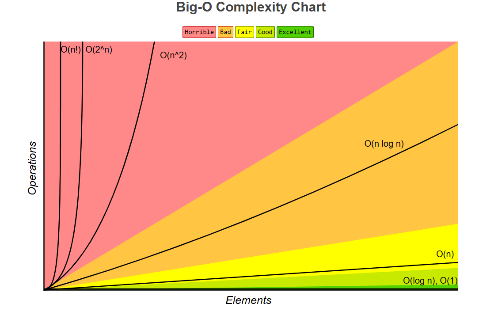
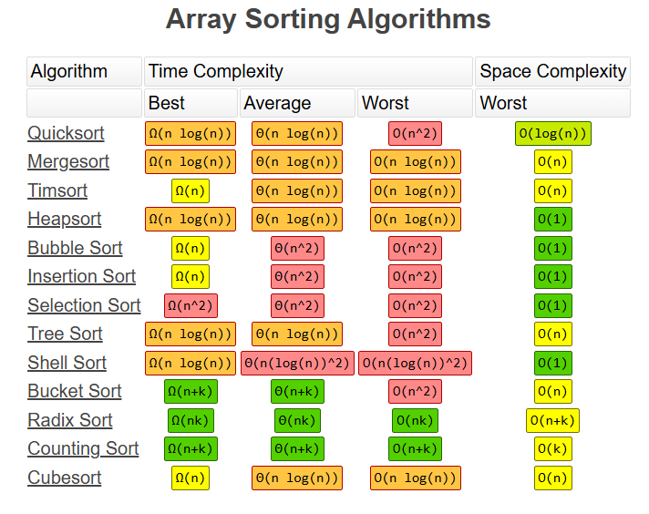

# 📊 Data Structures and Algorithms - DAY 1

## 🤔 1. What is a Data Structure?

> **🎯 Core Definition**: At its core, a **data structure** is just a way of organizing and storing data in a computer so we can use it efficiently!

### 🏠 Real-Life Analogy: Organizing Your Pantry

Think about it like organizing your **pantry**:

| **😩 Disorganized Pantry** | **✨ Organized Pantry** |
|---------------------------|-------------------------|
| All groceries in a giant pile on the floor | Canned goods on one shelf |
| Finding a can of beans = nightmare | Spices in a rack |
| Complete chaos | Pasta in a separate bin |
| **Result**: Inefficient and frustrating | **Result**: Quick and easy to find items |

**🎯 Key Point**: Data structures provide a **specific, logical way** to arrange data so that certain operations, like **searching** for an item or **adding** a new one, become much more efficient.

---

### 💡 Need for Data Structures

Why bother with all this organization? Here are the **two main reasons**:

| **Benefit** | **Description** | **Example** |
|------------|-----------------|-------------|
| ⚡ **Efficiency** | Well-chosen data structure can drastically speed up tasks | Finding a contact in sorted vs unsorted phone book |
| 📈 **Scalability** | Ensures program doesn't slow down as data grows | Code works well with 100 items AND 100,000 items |

---

## 🗂️ 2. Types of Data Structures

The world of data structures is broadly divided into **two main categories**:

### ➡️ Linear Data Structures

**📖 Definition**: Elements are arranged **sequentially**, one after another.

**🚶‍♀️ Analogy**: Think of a line of people waiting for a bus. Each person is connected to the one in front and the one behind.

| **Data Structure** | **Description** | **Real-World Example** |
|-------------------|-----------------|------------------------|
| 📋 **Arrays** | Simple list of items in contiguous memory | Shopping list with numbered items |
| 🔗 **Linked Lists** | Chain of items where each points to the next | Train cars connected together |
| 📚 **Stacks** | Add/remove items from one end only | Stack of plates 🍽️ |
| 🚶‍♀️ **Queues** | Add to one end, remove from other | Line at a store checkout |

---

### 🕸️ Non-linear Data Structures

**📖 Definition**: Elements don't arrange in a simple sequence. Instead, elements can be connected to **multiple other elements**, forming complex, hierarchical, or networked relationships.

| **Data Structure** | **Description** | **Real-World Example** |
|-------------------|-----------------|------------------------|
| 🌳 **Trees** | Hierarchical structure | Family tree, file system folders 📁 |
| 🗺️ **Graphs** | Network of connected points | Map showing cities and roads between them |

---

## 🎯 3. Abstract Data Types (ADT)

### 📋 What is an ADT?

**📖 Definition**: An **Abstract Data Type (ADT)** is a mathematical model for a data structure. It's a **blueprint** or **contract** that defines **what** operations can be performed on the data, but doesn't specify **how** those operations are implemented.

### 📚 Example: Stack ADT

| **Component** | **Description** |
|---------------|-----------------|
| **📋 Blueprint** | Stack ADT defines the "contract" |
| **🔧 Operations** | `push` (add item), `pop` (remove item), `peek` (look at top) |
| **🛠️ Implementation** | Can use array OR linked list - still a stack! |
| **🎯 Focus** | **What** you can do, not **how** you do it |

**💡 Key Insight**: The ADT focuses on the **interface** (what operations are available) rather than the **implementation** (how those operations work internally).

---

## ⏰ 4. Time & Space Complexity

> **🎯 Critical Concept**: **Complexity analysis** helps us measure how well an algorithm performs in terms of **time** and **memory**.

### 📊 Two Types of Complexity

| **Type** | **Measures** | **Question Asked** |
|----------|--------------|-------------------|
| ⏱️ **Time Complexity** | How long algorithm takes to run | "How does runtime change as input grows?" |
| 💾 **Space Complexity** | How much extra memory needed | "How does memory usage change as input grows?" |

---

### 📈 Big O Notation

We use **Big O notation (O)** to describe the **worst-case** scenario for an algorithm's performance. It expresses the **upper bound** of the growth rate.

| **Notation** | **Case** | **Usage** |
|--------------|----------|-----------|
| **O** (Big O) | **Worst Case** | 🔴 Most common - maximum resources needed |
| **Ω** (Big Omega) | **Best Case** | 🟢 Minimum resources needed |
| **Θ** (Big Theta) | **Average Case** | 🟡 Typical performance |

---

### 🔍 Example: Linear Search Algorithm

**📋 Scenario**: You have an unsorted array: `[10, 2, 8, 5, 1, 9]`. Find the number 8.

```cpp
// 🔍 Linear Search Implementation
function linearSearch(array, target) {
    for (i = 0; i < array.length; i++) {
        if (array[i] == target) {
            return i; // Found it! 🎯
        }
    }
    return -1; // Not found 😞
}
```

#### 📊 Complexity Analysis

| **Case** | **Scenario** | **Iterations** | **Big O** | **Example** |
|----------|--------------|----------------|-----------|-------------|
| 🟢 **Best Case (Ω)** | Target is first element | 1 | **O(1)** | Searching for `10` |
| 🔴 **Worst Case (O)** | Target is last/not found | n | **O(n)** | Searching for `9` or `99` |
| 🟡 **Average Case (Θ)** | Target in middle | n/2 | **O(n)** | Typically mid-array |

#### 🎯 Key Insights

**💡 Why O(n) for Average Case?**
- Even though average case runs ~n/2 times
- Big O **ignores constant factors** like 1/2
- Focus is on **overall growth trend**
- As n gets very large, the difference between n and n/2 becomes negligible

**🚀 Goal in DSA**: Write algorithms with **better complexity**
- **O(log n)** (logarithmic) is much better than **O(n)** (linear)
- **O(1)** (constant) is the holy grail for many operations

---

## 📸 Visual References

Below are the essential diagrams and charts for understanding Data Structures and Algorithms:

### 📈 Big O Complexity Chart


### ⏰ Time Complexity vs Data Complexity


### 🔄 Time Complexity of Sorting Algorithms


---

## 📝 Key Takeaways

✅ **Data Structures**: Organized ways to store and access data efficiently

✅ **Linear vs Non-linear**: Sequential arrangement vs complex relationships

✅ **Abstract Data Types**: Define WHAT operations are possible, not HOW they're implemented

✅ **Time Complexity**: Measures how algorithm performance scales with input size

✅ **Big O Notation**: Describes worst-case performance in terms of growth rate

✅ **Optimization Goal**: Choose data structures and algorithms with better complexity for scalable solutions

---

*Next: We'll explore specific data structures like Arrays, Linked Lists, Stacks, and Queues in detail!* 🚀