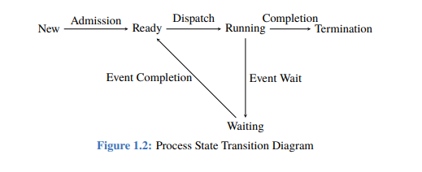
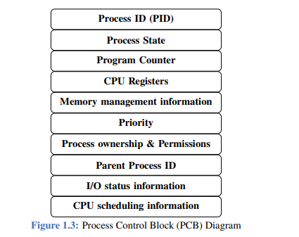

# Operating System Fundamentals

## 1.1 Operating System (OS)

An **Operating System (OS)** is the fundamental software that manages computer hardware and provides essential services for computer programs. It acts as an intermediary between the hardware and the user/application software. The OS is crucial for making the computer usable and efficient.

### Types of Operating Systems

The sources categorize operating systems based on how they manage tasks and user interactions:
#### 1. Batch Operating System
- **Description**: In a batch operating system, tasks or jobs are grouped together and processed in batches without user interaction. This type of OS is efficient for repetitive tasks and aims to reduce CPU idle time.
- **Flow**: Jobs are placed in a queue, selected, loaded into memory, executed, and their output is written to disk. One job completes before the next one starts.
- **Characteristics**: They are not suitable for interactive applications. A key characteristic is no preemption, meaning a running job holds the CPU until it completes or voluntarily gives it up. This design often leads to less throughput and can result in starvation (where some jobs might wait indefinitely).

#### 2. Multiprogramming Operating System
- **Description**: This OS allows multiple programs to be loaded into memory at the same time. The CPU is switched between these programs, significantly increasing overall system utilization.
- **Efficiency**: The CPU is not kept idle; whenever a job needs to perform an I/O operation (which takes time), the CPU can quickly switch to another job and process it.
- **Characteristics**: Compared to batch OS, it offers more efficiency and more throughput. It also helps prevent starvation. However, similar to batch systems, the traditional multiprogramming OS as described in the source typically implies no preemption, meaning a program would run until it voluntarily yields the CPU (e.g., for I/O).

#### 3. Preemptive vs. Non-Preemptive Operating Systems

- The concepts of **"preemption"** and **"no-preemption"** are crucial here.
- **Preemption** is the OS's ability to interrupt a running process and assign the CPU to another, even if the current process hasn't finished. This ensures fair CPU time allocation and responsiveness, crucial for interactive systems.
- **Non-Preemptive systems** (like the Batch and traditional Multiprogramming OS described) rely on a process voluntarily releasing the CPU. If a process enters an infinite loop or performs a long computation without I/O, other processes will have to wait indefinitely.

#### 4. Real-Time Operating System (RTOS)
- **Description**: This type of operating system is specifically designed to process data with strict time constraints. The primary goal of an RTOS is to ensure that operations are completed within specified deadlines.
- **Importance**: They are critical for applications where precise timing and predictability are paramount, such as industrial control systems, medical equipment, vehicle control systems, and robotics.

#### 5. Distributed Operating System
- **Description**: A distributed operating system runs on multiple interconnected computers, enabling them to function as a single, cohesive system.
- **Features**: It provides transparency (users perceive it as a single system), communication mechanisms, and resource sharing across the network environment.

#### 6. Network Operating System (NOS)
- **Description**: A NOS is specifically designed to support networked computing.
- **Features**: It includes built-in features for facilitating file sharing, printer sharing, and communication between different computers on a network.

#### 7. Embedded Operating System
- **Description**: These are specialized operating systems designed to run on embedded systems, which are computing devices with a dedicated, often non-general-purpose, function.
- **Examples**: Operating systems found in smartphones, Internet of Things (IoT) devices, and industrial machinery are common examples.

#### 8. Mobile Operating System
- **Description**: Specifically tailored for mobile devices such as smartphones and tablets.
- **Features**: They offer features unique to mobile computing, including touch input, comprehensive application management, and various wireless communication capabilities.

#### 9. Single-User Operating System
- **Description**: Designed to accommodate only one user at a time.
- **Common Use**: Typically found in personal computers, providing a straightforward interface for individual tasks.

#### 10. Multi-User Operating System
- **Description**: This OS allows multiple users to access the computer system concurrently.
- **Features**: It provides robust features for user authentication, resource sharing, and access control, ensuring that multiple users can work on the same system without interfering with each other.
- **Your Windows OS**: As we discussed, if you are using Windows, you are primarily using a multi-user operating system.
---

## 1.2 Kernel

The **kernel** is the core component of an operating system. It functions as the central module of the OS and is responsible for managing hardware resources and providing essential services to software applications. It is the most critical part of the OS, acting as an intermediary between the hardware and user applications.

### 1.2.2 Mode Bit

The **mode bit** in an operating system is a fundamental mechanism that plays a vital role in managing privilege levels. Its primary purposes include:

- **Enforcing security**
- **Protecting critical resources**
- **Isolating user processes** from the core functions of the operating system

By controlling the level of access that processes have to system resources, the mode bit contributes to the overall stability, security, and reliability of the operating system. For instance, when the mode bit is set to **"user mode,"** a program has limited access to system resources, preventing it from directly harming the system or other programs. When it's in **"kernel mode,"** the OS kernel has full access to hardware.

### Types of Kernels

While the provided sources define the kernel and the mode bit, they do not detail the different architectural types of kernels. Understanding these types is important because they represent different design philosophies for an OS's core:
#### 1. Monolithic Kernel
- **Description**: In a monolithic kernel, all operating system services (like process management, memory management, file systems, and device drivers) are packed into a single, large executable program that runs entirely in kernel space.
- **Pros**: This design often leads to high performance because all services reside in the same memory space, allowing for direct and fast function calls between components.
- **Cons**: It can be complex to develop and maintain due to its large size and tight coupling between components. A bug in one part of the kernel can crash the entire system. Examples include Linux and older Unix systems.

#### 2. Microkernel
- **Description**: A microkernel aims to minimize the code running in kernel space. Only the most essential services, such as inter-process communication (IPC) and basic memory management, reside in the kernel. Other OS services (e.g., file systems, device drivers, networking) run as separate user-space processes.
- **Pros**: Offers better modularity, reliability, and fault isolation. If a user-space driver crashes, it doesn't necessarily bring down the entire system. It's also easier to extend and port to new hardware.
- **Cons**: Can suffer from performance overhead due to the increased number of context switches and message passing (IPC) between user-space services and the kernel. Examples include QNX and the original Mach kernel.

#### 3. Hybrid Kernel
- **Description**: A hybrid kernel attempts to combine the benefits of both monolithic and microkernel designs. It has a microkernel-like structure but includes some non-essential components (like network stacks or certain device drivers) in kernel space for performance reasons. This approach seeks a balance between modularity and performance.
- **Relevance to your system**: Windows NT (on which modern Windows operating systems are based) utilizes a hybrid kernel. This explains why your Windows OS can handle complex tasks efficiently while maintaining a degree of modularity and protection.

#### 4. Exokernel
- **Description**: This is a more experimental approach that takes the microkernel concept to an extreme. An exokernel provides only secure multiplexing of hardware resources, allowing user-level libraries to implement almost all OS functionalities.
- **Concept**: It gives application developers more control over hardware resources, enabling highly specialized and optimized applications.

#### 5. Nanokernel
- **Description**: Similar to microkernels, but with an even smaller core. Often used to refer to extremely minimalist kernels that primarily provide hardware abstraction.
---

## 1.3 System Calls

**System calls** are crucial functions or routines provided by the operating system that serve as an interface, allowing user-level processes or programs to request services or functionality directly from the operating system kernel. They enable applications to perform operations that require higher privileges or direct access to system resources.

### Why System Calls are Needed

User programs run in a restricted **"user mode"** (as determined by the mode bit) to prevent accidental or malicious interference with the system's core functions or other programs. System calls bridge this gap by providing a controlled and secure way for user programs to access privileged operations:

- **Protection and Security**: Without system calls, user programs could directly access hardware or critical kernel data, leading to system instability or security breaches. System calls act as a gateway, ensuring that all requests for privileged operations are validated and executed by the trusted kernel.
- **Abstraction**: They abstract away the complex underlying hardware details. Programmers don't need to know the specifics of how a hard drive works to read a file; they just use the `read()` system call. This simplifies programming and makes applications portable across different hardware configurations.
- **Resource Management**: The operating system is responsible for managing shared resources like the CPU, memory, and I/O devices. System calls enable processes to request, allocate, and release these shared resources in a coordinated manner, preventing conflicts and ensuring fair distribution.

### Types of System Calls

The sources list several categories of system calls:
#### 1. Process Control System Calls
These are used for managing and controlling processes:

- **`fork()`**: This system call creates a new process by duplicating the calling process (the parent process). The new process (child process) is an almost identical copy of the parent.
- **`exec()`**: This call replaces the current process's memory image with a new one. It loads a new program into the address space of the calling process and starts its execution, effectively transforming the current process into a new one.
- **`wait()`**: Causes a process (typically a parent process) to pause its execution until one of its child processes exits. This allows the parent to collect information about the child's termination.

#### 2. File Management System Calls
These are used for interacting with files and devices:

- **`open()`**: Opens a file or device, returning a file descriptor (a non-negative integer that uniquely identifies the open file or socket).
- **`read()`**: Reads data from a specified file descriptor into a buffer.
- **`write()`**: Writes data from a buffer to a specified file descriptor.
- **`close()`**: Closes a file descriptor, releasing the resource.

#### 3. Memory Management System Calls
These allow processes to manage their memory usage:

- **`brk()`**: Changes the end of the data (heap) segment of a process, allowing it to increase or decrease its allocated memory for the heap.
- **`mmap()`**: Maps files or devices into memory, allowing them to be accessed as if they were part of the process's address space. This is often used for efficient file I/O or inter-process communication.
- **`munmap()`**: Unmaps files or devices from memory, releasing the memory region previously mapped.

#### 4. Network Communication System Calls
These facilitate network interactions between processes:

- **`socket()`**: Creates a new communication endpoint, known as a socket. A socket is a combination of an IP address and a port number, representing the endpoint of a communication channel.
- **`bind()`, `listen()`, `accept()`**: These calls are used to set up a server socket for network communication, allowing a server process to listen for and accept incoming client connections.
- **`connect()`**: Establishes a connection to a remote socket, typically used by client processes to initiate communication with a server.
---

## 1.4 Process

A **process** is fundamentally defined as a program in execution. It represents the basic unit of work within an operating system. Each process operates within its own dedicated memory space and resources.

### 1.4.2 Process State Transition Diagram

During its lifecycle, a process goes through various states. The sources explicitly mention two key states:

- **New**: In this initial state, the process is being created. The operating system allocates necessary resources, initializes data structures, and prepares the process for execution. Once this setup is complete, the process moves to the "Ready" state.
- **Ready**: A process in the "Ready" state is prepared to execute but is currently waiting for the CPU to be assigned. In a multitasking environment, multiple processes can reside in this state, and the operating system's scheduler is responsible for determining which ready process will get the CPU next.

### Other Important Process States

The provided text only explicitly details "New" and "Ready" states, but a complete understanding of process lifecycle usually includes other states:

- **Running**: This is the state where the process's instructions are actively being executed by the CPU. On a single-core CPU, only one process can be in the running state at any given moment. In multi-core systems, multiple processes can run concurrently, one per core. A process moves from the Ready state to the Running state when chosen by the scheduler.

- **Waiting (or Blocked)**: A process enters this state when it needs to wait for some event to occur before it can continue execution. Common events include:
  - Completion of an I/O operation (e.g., reading data from a disk or network, or printing to a printer)
  - Waiting for a resource to become available (e.g., a shared lock or a specific amount of memory)
  - Waiting for a signal from another process
  
  While in the Waiting state, the process is not consuming CPU time. Once the awaited event occurs, the process transitions back to the Ready state.

- **Terminated (or Exit)**: A process reaches this final state after it has completed its execution or has been aborted by the operating system (e.g., due to a critical error, external termination signal). At this point, the operating system will deallocate the resources that were assigned to the process.

### Process Control Block (PCB)

Although not fully detailed in section 1.4, the "Placement Preparation Booklet" mentions that CPU scheduling information is part of a process's details and that a PCB's purpose is to store "information about a process".
#### Definition
The **Process Control Block (PCB)**, sometimes called a Task Control Block, is a data structure maintained by the operating system for each process. It acts as a comprehensive repository, containing all the essential information required by the OS to manage and control a particular process. When a process is created, the OS allocates a PCB for it, and when the process terminates, the PCB is deallocated.

#### Key Information Stored in a PCB
The PCB is critical for the OS to perform various operations, especially **context switching** (saving the state of one process and loading the state of another). Typical information includes:

- **Process State**: The current state of the process (e.g., New, Ready, Running, Waiting, Terminated)
- **Program Counter**: The address of the next instruction to be executed for this process
- **CPU Registers**: The content of all CPU registers (like accumulators, index registers, stack pointers, etc.) that must be saved when a process switches from the CPU. These are restored when the process resumes execution
- **CPU Scheduling Information**: This includes the process's priority, pointers to the various scheduling queues (such as the ready queue), and other scheduling parameters necessary for the CPU scheduler
- **Memory Management Information**: Details about the process's memory space, such as the base and limit registers, page tables, or segment tables
- **Accounting Information**: Data like the amount of CPU time consumed, real time used, time limits, and job or process numbers
- **I/O Status Information**: A list of I/O devices allocated to the process, a list of open files, and any pending I/O requests

