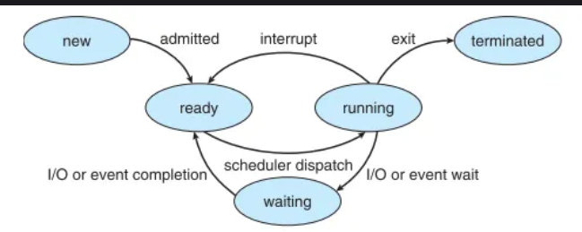

# 🔧 Operating Systems - DAY 2a Learning Notes

## 📞 What are System Calls?

### 🎯 Definition

At its heart, a **system call** is a **function or routine** that the operating system provides, allowing your **user-level programs** (like a web browser, word processor, or game) to **request specific services or functionality** directly from the operating system kernel.

**Purpose:** They act as an **essential interface** between your application and the low-level functions of the operating system, enabling your programs to perform operations that require:
- **Higher privileges**
- **Direct access to system resources** (such as hardware)

---

### 🍽️ Real-Life Analogy: The Restaurant and the Kitchen

Imagine you're at a restaurant:

**🙋‍♂️ You (User Program):** Want a meal or drink
**🚫 Not Allowed:** You don't walk directly into the kitchen (computer hardware/OS kernel) to cook your food - that would be chaotic and dangerous!

**👨‍🍳 Instead:** You make a request to a **waiter (System Call)**
- **Waiter's Role:** Goes into kitchen, has privileged access to ingredients and cooking equipment
- **Service:** Prepares your order and brings it back to you
- **Your Benefit:** You don't need to know intricate kitchen operations - just need a way to request the service

**🖥️ Similarly:** A program makes a **system call**, and the **operating system's kernel** handles the low-level, privileged operations without the program needing to understand underlying hardware complexities.

---

## 🔐 Why are System Calls Necessary? The Role of the Mode Bit

This controlled interaction is **critical** due to **privilege levels** within the operating system, managed by something called the **mode bit**.

### 👤 User Mode
**When applications run:** They typically execute in **user mode**

**Characteristics:**
- **🔒 Limited access** to system resources
- **🚫 Cannot directly interact** with hardware
- **🛡️ Security measure:** Prevents a single faulty or malicious program from:
  - Crashing the entire system
  - Accessing sensitive data belonging to other applications or OS

### 👑 Kernel Mode (Supervisor Mode)
**OS kernel runs in:** **Kernel mode** - highly privileged mode

**Characteristics:**
- **🔓 Full access** to all hardware and memory
- **👑 "Master" control** of your computer

---

### ⚙️ Mode Bit Mechanism

The **mode bit** is a **fundamental mechanism** that dictates the current **privilege level of the CPU**.

#### **🔄 System Call Process:**

1. **📞 Request:** User program needs kernel-level privileges (reading file, creating process, accessing network)
2. **🚫 Blocked:** Cannot perform operation directly
3. **📢 System Call:** Must use a system call - triggers **software interrupt/trap**
4. **💭 CPU Message:** "Hey, I need to switch from user mode to kernel mode!"
5. **🔄 Mode Switch:** CPU safely transitions to kernel mode
6. **⚡ Execution:** OS kernel executes the requested service
7. **🔙 Return:** Control returned to user program, CPU switches back to user mode

**🛡️ Result:** Critical system resources are **protected and managed reliably**

---

## 📂 Types of System Calls

The sources break down system calls into **several categories** based on the type of service they provide:

### **1. 🔄 Process Control System Calls**
**Purpose:** Used to **manage processes** (programs in execution)

| System Call | Function |
|:------------|:---------|
| **`fork()`** | Creates new process by **duplicating calling process** (parent). New process = child process |
| **`exec()`** | **Replaces current process's memory** image with new one. Typically used after `fork()` to run new program in child |
| **`wait()`** | Causes process (typically parent) to **wait until child process exits** |

---

### **2. 📁 File Management System Calls**
**Purpose:** Enable programs to **interact with files and file systems**

| System Call | Function |
|:------------|:---------|
| **`open()`** | **Opens file/device**, returns file descriptor (non-negative integer uniquely identifying open file/socket) |
| **`read()`** | **Reads data** from file descriptor into buffer |
| **`write()`** | **Writes data** from buffer to file descriptor |
| **`close()`** | **Closes file descriptor** |

---

### **3. 🖥️ Device Management System Calls**
**Purpose:** Direct interaction with **I/O devices**

| System Call | Function |
|:------------|:---------|
| **`ioctl()`** | Performs **I/O control operations** on devices |
| **`read()`, `write()`** | Can also be used to **read from/write to devices** (as mentioned in file management) |

---

### **4. ℹ️ Information Maintenance System Calls**
**Purpose:** Provide **information about system or processes**

| System Call | Function |
|:------------|:---------|
| **`getpid()`** | Returns **process ID (PID)** of calling process |
| **`getuid()`** | Returns **user ID** of calling process |
| **`time()`** | Returns **current time** |

---

### **5. 💬 Communication System Calls**
**Purpose:** Facilitate **inter-process communication (IPC)**

| System Call | Function |
|:------------|:---------|
| **`pipe()`** | Creates **communication pipe** between two processes |
| **`msgget()`, `msgsnd()`, `msgrcv()`** | Used for **message queues** to send and receive messages |
| **`semget()`, `semop()`, `semctl()`** | Create, operate on, and control **semaphore sets** for synchronization |

---

### **6. 🧠 Memory Management System Calls**
**Purpose:** Manage a **process's memory space**

| System Call | Function |
|:------------|:---------|
| **`brk()`** | **Changes end of data (heap) segment** of process |
| **`mmap()`** | **Maps files or devices** into memory |
| **`munmap()`** | **Unmaps files or devices** from memory |

---

### **7. 🌐 Network Communication System Calls**
**Purpose:** Specifically for **network operations**

| System Call | Function |
|:------------|:---------|
| **`socket()`** | Creates new **communication endpoint** (socket) |
| **`bind()`, `listen()`, `accept()`** | Set up **server socket** for network communication |
| **`connect()`** | Establishes **connection to remote socket** |

---

## 💻 Practical Examples and Code Snippets

Let's look at some **basic C/pseudo-code examples** to illustrate how system calls are used.

---

### **1. 🍴 Creating a New Process with `fork()`**

The **`fork()` system call** is one of the most fundamental for **process creation** in Unix-like systems. When `fork()` is called, it creates a new process that is an **almost identical copy** of the calling process.

```c
#include <stdio.h>    // For printf
#include <unistd.h>   // For fork() and getpid()
#include <sys/wait.h> // For wait()

int main() {
    printf("Original process (PID: %d) is about to fork.\n", getpid());

    // Call the fork() system call
    // A new process is created by duplicating the calling process
    pid_t pid = fork();

    if (pid == -1) {
        // -1 indicates an error occurred during fork
        perror("fork failed"); // perror prints a system error message
        return 1; // Indicate failure
    } else if (pid == 0) {
        // If pid is 0, this code is executing in the CHILD process
        printf("Hello from the CHILD process! My PID: %d, My Parent's PID: %d\n", 
               getpid(), getppid());
    } else {
        // If pid is > 0, this code is executing in the PARENT process
        // The value of pid is the Process ID (PID) of the newly created child process
        printf("Hello from the PARENT process! My PID: %d, My Child's PID: %d\n", 
               getpid(), pid);
        wait(NULL); // Parent waits for the child process to terminate
        printf("Parent process detected child termination.\n");
    }

    printf("Process %d finished.\n", getpid());
    return 0; // Indicate success
}
```

#### **🔨 How to Compile and Run (Linux Terminal):**
1. **Save code as:** `fork_example.c`
2. **Compile:** `gcc fork_example.c -o fork_example`
3. **Run:** `./fork_example`

**📋 Result:** You will see output from both parent and child processes, demonstrating how `fork()` creates **two independent execution flows**.

---

### **2. 📁 File Operations with `open()`, `read()`, `write()`, `close()`**

These system calls are **essential for interacting with the file system**.

```c
#include <stdio.h>   // For printf, perror
#include <fcntl.h>   // For open() flags like O_CREAT, O_WRONLY, O_RDONLY, O_TRUNC
#include <unistd.h>  // For write(), read(), close()

int main() {
    int file_descriptor; // This will store the integer file descriptor
    char write_buffer[] = "This is a test message for system calls.\n";
    char read_buffer[11]; // Buffer to hold data read from the file

    // 1. Open a file for writing (create if not exists, truncate if exists)
    // The open() system call opens a file and creates a file descriptor
    file_descriptor = open("my_test_file.txt", O_CREAT | O_WRONLY | O_TRUNC, 0644);
    if (file_descriptor == -1) {
        perror("Error opening file for writing");
        return 1;
    }
    printf("Successfully opened 'my_test_file.txt' for writing. File Descriptor: %d\n", 
           file_descriptor);

    // 2. Write data to the file
    // The write() system call writes data from a buffer to a file descriptor
    ssize_t bytes_written = write(file_descriptor, write_buffer, sizeof(write_buffer) - 1); 
    // -1 to exclude null terminator
    if (bytes_written == -1) {
        perror("Error writing to file");
        close(file_descriptor); // Always close on error
        return 1;
    }
    printf("Successfully wrote %zd bytes to 'my_test_file.txt'.\n", bytes_written);

    // 3. Close the file
    // The close() system call closes a file descriptor
    if (close(file_descriptor) == -1) {
        perror("Error closing file after writing");
        return 1;
    }
    printf("File 'my_test_file.txt' closed after writing.\n");

    // 4. Open the same file for reading
    file_descriptor = open("my_test_file.txt", O_RDONLY);
    if (file_descriptor == -1) {
        perror("Error opening file for reading");
        return 1;
    }
    printf("Successfully opened 'my_test_file.txt' for reading. File Descriptor: %d\n", 
           file_descriptor);

    // 5. Read data from the file
    // The read() system call reads data from a file descriptor into a buffer
    ssize_t bytes_read = read(file_descriptor, read_buffer, sizeof(read_buffer) - 1); 
    // -1 for null terminator
    if (bytes_read == -1) {
        perror("Error reading from file");
        close(file_descriptor);
        return 1;
    }
    read_buffer[bytes_read] = '\0'; // Null-terminate the string
    printf("Successfully read %zd bytes from 'my_test_file.txt': \"%s\"\n", 
           bytes_read, read_buffer);

    // 6. Close the file again
    if (close(file_descriptor) == -1) {
        perror("Error closing file after reading");
        return 1;
    }
    printf("File 'my_test_file.txt' closed after reading.\n");

    return 0;
}
```

#### **🔨 How to Compile and Run (Linux Terminal):**
1. **Save code as:** `file_io_example.c`
2. **Compile:** `gcc file_io_example.c -o file_io_example`
3. **Run:** `./file_io_example`

**📋 Result:** You will also find a new file named `my_test_file.txt` in the same directory.

---

### **3. 🐧 Linux Commands and System Calls**

When you use **common Linux commands**, they often make use of **system calls behind the scenes**. 

#### **📋 Example: `ls` Command**

When you type `ls` to **list directory contents**, the `ls` program (user-level program) needs to ask the kernel for information about files and directories.

**🔍 What `ls` does internally using system calls:**

| Step | System Call | Purpose |
|:-----|:------------|:--------|
| **1** | `open()` | **Open the directory** |
| **2** | `getdents()` or `readdir()` | **Read entries** (files and subdirectories) within opened directory |
| **3** | `stat()` | **Get metadata** (permissions, size, modification time, etc.) for each file/directory |
| **4** | `close()` | **Close the directory** when finished |

**💡 Key Point:** While `ls` is a command you type, its **functionality is built upon fundamental system calls** that interact with the file system on your behalf, managed by the kernel.

---

## 🎯 Practice Questions / Exercises

To reinforce your understanding of system calls, try these:

### **Question 1: Fundamental Purpose**
**Challenge:** In your own words, explain the **primary role of system calls** and why they are an **essential part of an operating system's design**. Focus on the concept of **privilege levels**.

---

### **Question 2: Scenario Analysis**
**Scenario:** If a program needs to **establish a network connection** to download a web page, which **category of system calls** would be primarily involved? 

**Requirements:** Name at least **one specific system call** from that category.

---

### **Question 3: Output Prediction**
**Scenario:** Consider a simple C program that calls `getpid()` and then immediately `fork()`.

**Questions:**
1. **What would be the output of `getpid()` in the parent process BEFORE the `fork()` call?**
2. **What would be the output of `getpid()` in the child process AFTER the `fork()` call?**
3. **What would be the return value of `fork()` in the parent process?**
   - *Hint: Refer to the `fork()` and `getpid()` descriptions*

---

### **Question 4: File Descriptor Concept**
**Question:** Why is a **file descriptor important** when a program interacts with files through system calls like `open()`, `read()`, and `write()`?

---

## 📝 Key Takeaways from DAY 2a

✅ **System Calls:** Essential interface between user programs and OS kernel for privileged operations

✅ **Mode Bit Mechanism:** Controls privilege levels - User Mode (limited) vs Kernel Mode (full access)

✅ **System Call Categories:** Process Control, File Management, Device Management, Information Maintenance, Communication, Memory Management, Network Communication

✅ **Fork() Process:** Creates child process by duplicating parent - fundamental for process creation

✅ **File Operations:** open(), read(), write(), close() system calls manage file interactions through file descriptors

✅ **Real-world Applications:** Common Linux commands (like ls) rely on system calls for functionality

✅ **Security & Stability:** System calls ensure controlled access to hardware and system resources

---


# 💻 Operating Systems - DAY 2b Learning Notes

## 🔄 Understanding a Process: Your OS's To-Do List Item

### 📚 Real-Life Analogy: The Recipe Book

Imagine you have a **recipe book** 📖. This book contains all the instructions, ingredients, and steps to bake various cakes. Now, imagine you decide to actually bake a cake from one of those recipes. You gather your ingredients, pull out your baking tools, start preheating the oven, and begin following the steps one by one.

### 🖥️ In the World of Operating Systems:

**📖 Program (Recipe Book):**
- Like a recipe book - it's a **static set of instructions or code** stored on your disk
- Just sitting there, waiting to be used
- **Passive entity**

**👨‍🍳 Process (Active Baking):**
- When you start actually baking a cake, that active endeavor is like a **process**
- It's the **program in execution**
- When you click on a web browser icon → you're starting a process
- When you run a game → you're starting a process
- **Active entity**

### 🎯 Key Takeaway

**Program vs Process:**
- **Program:** Passive, static code stored on disk
- **Process:** Active entity - "program in execution"
- Each process is the **basic unit of work** in an operating system
- **Critical:** Each process gets its own **memory space and resources**

**Example:** If you open two instances of your web browser, the OS treats them as **two separate processes**, each with its own resources, even though they originated from the same program.

---

## 🆔 What the OS Knows About Your Process: The Process Control Block (PCB)

To manage all these active "baking" tasks (processes), the Operating System needs to keep track of a lot of information for each one. Think of this information as the **"ID card" or "passport"** for each process. This "ID card" is called the **Process Control Block (PCB)**.

### 📋 PCB Components

The PCB contains **vital information** that the OS uses to manage and control the process:

#### **🔢 Process ID (PID)**
- **Unique identification number** assigned to each process by the OS
- 🎂 **Analogy:** Like a unique baker's ID number for each person baking a cake

#### **🚦 Process State**
- Tells the OS what the process is **currently doing**
- Examples: waiting for ingredients, actively baking, or finished
- We'll explore process states in detail next

#### **📍 Program Counter**
- **Pointer to the next instruction** to be executed for that process
- 📖 **Analogy:** Like a bookmark in your recipe, telling you exactly which step to do next

#### **💾 CPU Registers**
- Hold values of CPU's internal registers when process was last interrupted
- Ensures process can **pick up exactly where it left off**
- 📝 **Analogy:** Baker noting down exact measurement values mid-step

#### **🏠 Memory Management Information**
- Details about **memory allocated** to the process
- Base and limit registers for memory protection
- Keeps each process's "kitchen space" separate and protected

#### **⭐ Priority**
- **Numerical value** determining process's precedence in resource allocation
- 🍰 **Note:** Some cakes (processes) are more urgent than others!

#### **👤 Process Ownership & Permissions**
- Information about **who owns the process** (which user)
- What **permissions** it has to access system resources

#### **👨‍👩‍👧‍👦 Parent Process ID**
- The **PID of the process that created this one**
- 🍰 **Analogy:** If main recipe instructed you to make side dish first, side dish prep would be "child process" of main cake-baking "parent process"

#### **💿 I/O Status Information**
- Describes **I/O devices allocated** to the process
- Status of **pending I/O operations**
- Example: waiting for data from hard drive or keyboard input

#### **⏰ CPU Scheduling Information**
- Details for **CPU scheduler decisions**
- When and for how long process should run
- CPU time consumed and scheduling priority

---

## 🔄 The Journey of a Process: Process States and Transitions

Processes in an operating system don't just "run" all the time. They go through a **lifecycle**, constantly changing states depending on what they are doing and what resources are available.

### 🎂 Analogy: Different Phases of Your Baking Task

Think of it as the different phases your baking task might go through!

### 📊 Process State Transition Diagram



---

### 🔄 Process States Explained

#### **1. 🆕 New State**
**What happens:** Process is being created
- OS is setting up "baking station"
- Allocating resources
- Initializing data structures like PCB
- Preparing for execution

**Transition:** Once setup complete → **Ready state** via **Admission**

---

#### **2. ⏳ Ready State**
**What happens:** Process is fully prepared to execute
- Waiting for CPU to become available
- Multiple processes might be in this state
- 🎂 **Analogy:** Several bakers waiting for their turn to use the oven

**Decision:** OS scheduler decides which one runs next

---

#### **3. ▶️ Running State**
**What happens:** CPU is assigned to process
- Process's instructions are **actually being executed** by CPU
- **Transition:** Moves from "Ready" via **Dispatch** event
- Can remain until it finishes task or is interrupted

---

#### **4. ⏸️ Waiting (Blocked) State**
**What happens:** Process needs something external to continue
- Waiting for data from file (I/O operation)
- Waiting for signal from another process
- **Temporarily gives up the CPU**

**Recovery:** Once required event occurs → back to **Ready state** via **Event Completion**

---

#### **5. ⛔ Termination State**
**What happens:** Process completes execution
- OS **deallocates its resources**
- Process lifecycle ends

---

### 🔄 Important State Transitions

| Transition | From → To | Description |
|:-----------|:----------|:------------|
| **🎯 Admission** | New → Ready | OS has prepared the process |
| **🚀 Dispatch** | Ready → Running | Scheduler picks process to run on CPU |
| **⏳ Event Wait** | Running → Waiting | Process needs to wait for event (I/O) |
| **✅ Event Completion** | Waiting → Ready | Event the process was waiting for completes |
| **🔄 Preemption** | Running → Ready | Multitasking OS interrupts process for fairness |
| **🏁 Completion** | Running → Termination | Process finishes execution |

---

## 🍰 Different Flavors of Processes

Just like there are different types of baking tasks, processes also come in various types:

### **1. 🖥️ Foreground Process**
**Definition:** Process you are **directly interacting with**
- Requires user input
- Often blocks user interface until completion
- **Example:** Typing in your word processor

---

### **2. 🔇 Background Process**
**Definition:** Processes running **independently of user interface**
- Don't need immediate user interaction
- Can run concurrently with foreground processes
- **Examples:**
  - Cloud syncing service running quietly
  - Antivirus scan

---

### **3. 👨‍👩‍👧‍👦 Parent & Child Processes** 
**Parent Process:** Creates other processes
**Child Process:** Created by parent process, inherits certain characteristics

**🎂 Analogy:** Main cake recipe (parent) instructing you to make specific frosting recipe (child process) as part of overall cake-baking

---

### **4. 👻 Daemon Process**
**Definition:** Special **background processes running continuously**
- Provide services or functions
- Handle system events, network services, scheduled jobs
- **Example:** Web server software always running, waiting for requests

---

### **5. 👤 Orphan Process**
**Definition:** Child process whose **parent terminated unexpectedly**
- Parent finished before child
- OS or init process usually "adopts" these orphans
- Ensures they complete execution

---

### **6. 🧟 Zombie Process**
**Definition:** Process that **completed execution** but still has entry in process table
- Happens when parent hasn't acknowledged termination
- "Zombie" entry exists until parent "reaps" it
- After acknowledgment, removed from system

---

## 💻 Hands-on: Process Management in Linux

Let's look at basic Linux terminal commands for interacting with processes:

### **📋 `ps aux` - Process Status**
**Function:** Displays information about currently running processes

**Command Breakdown:**
- `ps`: process status
- `a`: shows processes for all users  
- `u`: displays user-oriented format
- `x`: shows processes not attached to terminal

**🎂 Practical Use:** See list of all current "baking projects" on system, who's working on them, and what they're trying to make.

**Output includes:** PIDs, users, CPU/memory usage, commands

---

### **📊 `top` or `htop` - Real-time Process Monitor**
**Function:** Dynamic, real-time view of system processes
- `htop` is enhanced version, often preferred for user-friendliness

**🎂 Practical Use:** Dashboard to see which "baking projects" consuming most CPU/memory right now, with sorting by various metrics.

---

### **❌ `kill PID` - Terminate Processes**
**Function:** Used to terminate processes using Process ID

**Commands:**
- `kill PID`: Normal termination
- `kill -9 PID`: Force kill (cannot be ignored)
- `killall process_name`: Kill by process name

**🎂 Practical Use:** If "baking project" is stuck or misbehaving, use kill to stop it.
**Example:** `kill 1234` terminates process with PID 1234

---

### **🍴 `fork()` System Call**
**Function:** Powerful mechanism to **create new process** by duplicating calling process

#### **How fork() Works:**

```c
// Pseudo-code example
int pid = fork();

if (pid == 0) {
    // This code runs in the CHILD process
    printf("I am the child process!");
} else if (pid > 0) {
    // This code runs in the PARENT process
    printf("I am the parent, my child's PID is %d", pid);
} else {
    // Fork failed
    printf("Fork failed!");
}
```

#### **🔍 Fork() Return Values:**
- **In child process:** `fork()` returns **0**
- **In parent process:** `fork()` returns **child's PID**
- **If fork() fails:** returns **-1**

#### **📝 Process:**
1. Original process (parent) calls `fork()`
2. OS creates nearly identical copy (child process)
3. Both processes continue execution from after `fork()` call
4. Different return values help distinguish parent from child

---

## 🎯 Practice Questions to Reinforce Learning

Let's test your understanding!

### **Question 1: Program vs. Process**
**Scenario:** You've downloaded a new video player application (.exe file).

**Questions:**
1. **Is this file a program or a process?**
2. **When you double-click it and start playing a video, what does it become?**
3. **If you then open another video in a separate window using the same player application, how does the OS likely treat these two video playbacks?**

---

### **Question 2: Process States**
**Challenge:** Describe a typical sequence of state transitions for a process that needs to:
- Read data from a file
- Perform some calculations  
- Finish execution

**Requirements:** Include at least **four distinct states** in your answer.

---

### **Question 3: The PCB's Importance**
**Scenario:** Imagine the Operating System didn't maintain a **"Program Counter"** in the PCB for a process.

**Question:** What problem would this create when the OS tries to **switch between multiple running processes**?

---

### **Question 4: Process Types Scenario**
**Part A:** Your computer is running a task that occasionally performs a **backup of your documents to the cloud** without you needing to click anything. What **type of process** is this likely to be?

**Part B:** What if a virus infection leads to a program being **forcibly stopped by its parent process**, but the **parent itself crashes immediately after**? What could potentially happen to the forcibly stopped **child process**?

---

## 📝 Key Takeaways from DAY 2

✅ **Program vs Process:** Program is passive code; Process is active execution of that code

✅ **Process Control Block (PCB):** OS maintains detailed "ID card" for each process with PID, state, memory info, etc.

✅ **Process States:** Processes cycle through New → Ready → Running → Waiting → Termination states

✅ **State Transitions:** Admission, Dispatch, Event Wait/Completion, Preemption, and Completion control process flow

✅ **Process Types:** Foreground, Background, Parent/Child, Daemon, Orphan, and Zombie processes serve different purposes

✅ **Linux Process Management:** `ps aux`, `top/htop`, `kill`, and `fork()` are essential tools for process control

✅ **Process Lifecycle:** Understanding how processes are created, managed, and terminated is crucial for OS comprehension

---

*Next: We'll dive into CPU scheduling algorithms, memory management, and inter-process communication!* 🚀