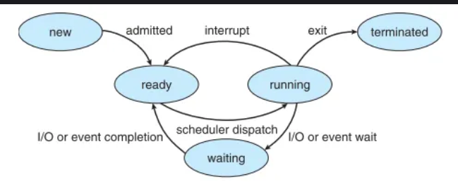

# 💻 Operating Systems - DAY 2b Learning Notes

## 🔄 Understanding a Process: Your OS's To-Do List Item

### 📚 Real-Life Analogy: The Recipe Book

Imagine you have a **recipe book** 📖. This book contains all the instructions, ingredients, and steps to bake various cakes. Now, imagine you decide to actually bake a cake from one of those recipes. You gather your ingredients, pull out your baking tools, start preheating the oven, and begin following the steps one by one.

### 🖥️ In the World of Operating Systems:

**📖 Program (Recipe Book):**
- Like a recipe book - it's a **static set of instructions or code** stored on your disk
- Just sitting there, waiting to be used
- **Passive entity**

**👨‍🍳 Process (Active Baking):**
- When you start actually baking a cake, that active endeavor is like a **process**
- It's the **program in execution**
- When you click on a web browser icon → you're starting a process
- When you run a game → you're starting a process
- **Active entity**

### 🎯 Key Takeaway

**Program vs Process:**
- **Program:** Passive, static code stored on disk
- **Process:** Active entity - "program in execution"
- Each process is the **basic unit of work** in an operating system
- **Critical:** Each process gets its own **memory space and resources**

**Example:** If you open two instances of your web browser, the OS treats them as **two separate processes**, each with its own resources, even though they originated from the same program.
---

## 🆔 What the OS Knows About Your Process: The Process Control Block (PCB)

To manage all these active "baking" tasks (processes), the Operating System needs to keep track of a lot of information for each one. Think of this information as the **"ID card" or "passport"** for each process. This "ID card" is called the **Process Control Block (PCB)**.

### 📋 PCB Components

The PCB contains **vital information** that the OS uses to manage and control the process:

#### **🔢 Process ID (PID)**
- **Unique identification number** assigned to each process by the OS
- 🎂 **Analogy:** Like a unique baker's ID number for each person baking a cake

#### **🚦 Process State**
- Tells the OS what the process is **currently doing**
- Examples: waiting for ingredients, actively baking, or finished
- We'll explore process states in detail next

#### **📍 Program Counter**
- **Pointer to the next instruction** to be executed for that process
- 📖 **Analogy:** Like a bookmark in your recipe, telling you exactly which step to do next

#### **💾 CPU Registers**
- Hold values of CPU's internal registers when process was last interrupted
- Ensures process can **pick up exactly where it left off**
- 📝 **Analogy:** Baker noting down exact measurement values mid-step

#### **🏠 Memory Management Information**
- Details about **memory allocated** to the process
- Base and limit registers for memory protection
- Keeps each process's "kitchen space" separate and protected

#### **⭐ Priority**
- **Numerical value** determining process's precedence in resource allocation
- 🍰 **Note:** Some cakes (processes) are more urgent than others!

#### **👤 Process Ownership & Permissions**
- Information about **who owns the process** (which user)
- What **permissions** it has to access system resources

#### **👨‍👩‍👧‍👦 Parent Process ID**
- The **PID of the process that created this one**
- 🍰 **Analogy:** If main recipe instructed you to make side dish first, side dish prep would be "child process" of main cake-baking "parent process"

#### **💿 I/O Status Information**
- Describes **I/O devices allocated** to the process
- Status of **pending I/O operations**
- Example: waiting for data from hard drive or keyboard input

#### **⏰ CPU Scheduling Information**
- Details for **CPU scheduler decisions**
- When and for how long process should run
- CPU time consumed and scheduling priority
---

## 🔄 The Journey of a Process: Process States and Transitions

Processes in an operating system don't just "run" all the time. They go through a **lifecycle**, constantly changing states depending on what they are doing and what resources are available.

### 🎂 Analogy: Different Phases of Your Baking Task

Think of it as the different phases your baking task might go through!

### 📊 Process State Transition Diagram



---

### 🔄 Process States Explained

#### **1. 🆕 New State**
**What happens:** Process is being created
- OS is setting up "baking station"
- Allocating resources
- Initializing data structures like PCB
- Preparing for execution

**Transition:** Once setup complete → **Ready state** via **Admission**

---

#### **2. ⏳ Ready State**
**What happens:** Process is fully prepared to execute
- Waiting for CPU to become available
- Multiple processes might be in this state
- 🎂 **Analogy:** Several bakers waiting for their turn to use the oven

**Decision:** OS scheduler decides which one runs next

---

#### **3. ▶️ Running State**
**What happens:** CPU is assigned to process
- Process's instructions are **actually being executed** by CPU
- **Transition:** Moves from "Ready" via **Dispatch** event
- Can remain until it finishes task or is interrupted

---

#### **4. ⏸️ Waiting (Blocked) State**
**What happens:** Process needs something external to continue
- Waiting for data from file (I/O operation)
- Waiting for signal from another process
- **Temporarily gives up the CPU**

**Recovery:** Once required event occurs → back to **Ready state** via **Event Completion**

---

#### **5. ⛔ Termination State**
**What happens:** Process completes execution
- OS **deallocates its resources**
- Process lifecycle ends

---

### 🔄 Important State Transitions

| Transition | From → To | Description |
|:-----------|:----------|:------------|
| **🎯 Admission** | New → Ready | OS has prepared the process |
| **🚀 Dispatch** | Ready → Running | Scheduler picks process to run on CPU |
| **⏳ Event Wait** | Running → Waiting | Process needs to wait for event (I/O) |
| **✅ Event Completion** | Waiting → Ready | Event the process was waiting for completes |
| **🔄 Preemption** | Running → Ready | Multitasking OS interrupts process for fairness |
| **🏁 Completion** | Running → Termination | Process finishes execution |
---

## 🍰 Different Flavors of Processes

Just like there are different types of baking tasks, processes also come in various types:

### **1. 🖥️ Foreground Process**
**Definition:** Process you are **directly interacting with**
- Requires user input
- Often blocks user interface until completion
- **Example:** Typing in your word processor

---

### **2. 🔇 Background Process**
**Definition:** Processes running **independently of user interface**
- Don't need immediate user interaction
- Can run concurrently with foreground processes
- **Examples:**
  - Cloud syncing service running quietly
  - Antivirus scan

---

### **3. 👨‍👩‍👧‍👦 Parent & Child Processes** 
**Parent Process:** Creates other processes
**Child Process:** Created by parent process, inherits certain characteristics

**🎂 Analogy:** Main cake recipe (parent) instructing you to make specific frosting recipe (child process) as part of overall cake-baking

---

### **4. 👻 Daemon Process**
**Definition:** Special **background processes running continuously**
- Provide services or functions
- Handle system events, network services, scheduled jobs
- **Example:** Web server software always running, waiting for requests

---

### **5. 👤 Orphan Process**
**Definition:** Child process whose **parent terminated unexpectedly**
- Parent finished before child
- OS or init process usually "adopts" these orphans
- Ensures they complete execution

---

### **6. 🧟 Zombie Process**
**Definition:** Process that **completed execution** but still has entry in process table
- Happens when parent hasn't acknowledged termination
- "Zombie" entry exists until parent "reaps" it
- After acknowledgment, removed from system

---

## 💻 Hands-on: Process Management in Linux

Let's look at basic Linux terminal commands for interacting with processes:

### **📋 `ps aux` - Process Status**
**Function:** Displays information about currently running processes

**Command Breakdown:**
- `ps`: process status
- `a`: shows processes for all users  
- `u`: displays user-oriented format
- `x`: shows processes not attached to terminal

**🎂 Practical Use:** See list of all current "baking projects" on system, who's working on them, and what they're trying to make.

**Output includes:** PIDs, users, CPU/memory usage, commands

---

### **📊 `top` or `htop` - Real-time Process Monitor**
**Function:** Dynamic, real-time view of system processes
- `htop` is enhanced version, often preferred for user-friendliness

**🎂 Practical Use:** Dashboard to see which "baking projects" consuming most CPU/memory right now, with sorting by various metrics.

---

### **❌ `kill PID` - Terminate Processes**
**Function:** Used to terminate processes using Process ID

**Commands:**
- `kill PID`: Normal termination
- `kill -9 PID`: Force kill (cannot be ignored)
- `killall process_name`: Kill by process name

**🎂 Practical Use:** If "baking project" is stuck or misbehaving, use kill to stop it.
**Example:** `kill 1234` terminates process with PID 1234

---

### **🍴 `fork()` System Call**
**Function:** Powerful mechanism to **create new process** by duplicating calling process

#### **How fork() Works:**

```c
// Pseudo-code example
int pid = fork();

if (pid == 0) {
    // This code runs in the CHILD process
    printf("I am the child process!");
} else if (pid > 0) {
    // This code runs in the PARENT process
    printf("I am the parent, my child's PID is %d", pid);
} else {
    // Fork failed
    printf("Fork failed!");
}
```

#### **🔍 Fork() Return Values:**
- **In child process:** `fork()` returns **0**
- **In parent process:** `fork()` returns **child's PID**
- **If fork() fails:** returns **-1**

#### **📝 Process:**
1. Original process (parent) calls `fork()`
2. OS creates nearly identical copy (child process)
3. Both processes continue execution from after `fork()` call
4. Different return values help distinguish parent from child
---

## 🎯 Practice Questions to Reinforce Learning

Let's test your understanding!

### **Question 1: Program vs. Process**
**Scenario:** You've downloaded a new video player application (.exe file).

**Questions:**
1. **Is this file a program or a process?**
2. **When you double-click it and start playing a video, what does it become?**
3. **If you then open another video in a separate window using the same player application, how does the OS likely treat these two video playbacks?**

---

### **Question 2: Process States**
**Challenge:** Describe a typical sequence of state transitions for a process that needs to:
- Read data from a file
- Perform some calculations  
- Finish execution

**Requirements:** Include at least **four distinct states** in your answer.

---

### **Question 3: The PCB's Importance**
**Scenario:** Imagine the Operating System didn't maintain a **"Program Counter"** in the PCB for a process.

**Question:** What problem would this create when the OS tries to **switch between multiple running processes**?

---

### **Question 4: Process Types Scenario**
**Part A:** Your computer is running a task that occasionally performs a **backup of your documents to the cloud** without you needing to click anything. What **type of process** is this likely to be?

**Part B:** What if a virus infection leads to a program being **forcibly stopped by its parent process**, but the **parent itself crashes immediately after**? What could potentially happen to the forcibly stopped **child process**?

---

## 📝 Key Takeaways from DAY 2

✅ **Program vs Process:** Program is passive code; Process is active execution of that code

✅ **Process Control Block (PCB):** OS maintains detailed "ID card" for each process with PID, state, memory info, etc.

✅ **Process States:** Processes cycle through New → Ready → Running → Waiting → Termination states

✅ **State Transitions:** Admission, Dispatch, Event Wait/Completion, Preemption, and Completion control process flow

✅ **Process Types:** Foreground, Background, Parent/Child, Daemon, Orphan, and Zombie processes serve different purposes

✅ **Linux Process Management:** `ps aux`, `top/htop`, `kill`, and `fork()` are essential tools for process control

✅ **Process Lifecycle:** Understanding how processes are created, managed, and terminated is crucial for OS comprehension

---

*Next: We'll dive into CPU scheduling algorithms, memory management, and inter-process communication!* 🚀